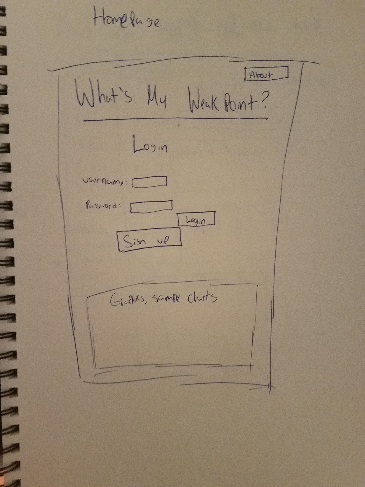
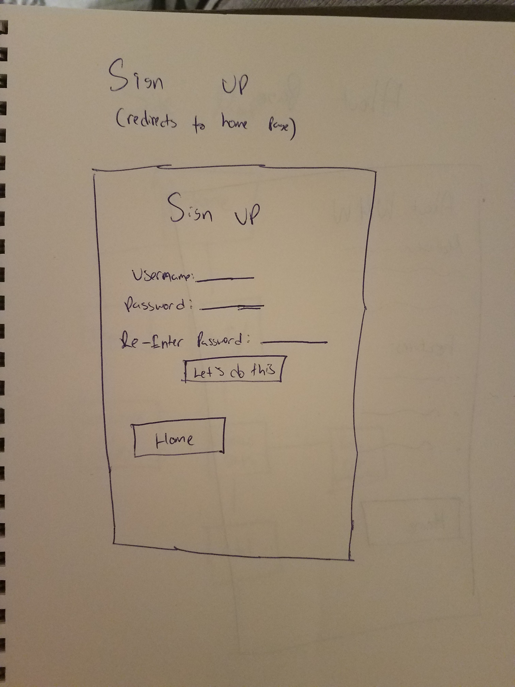
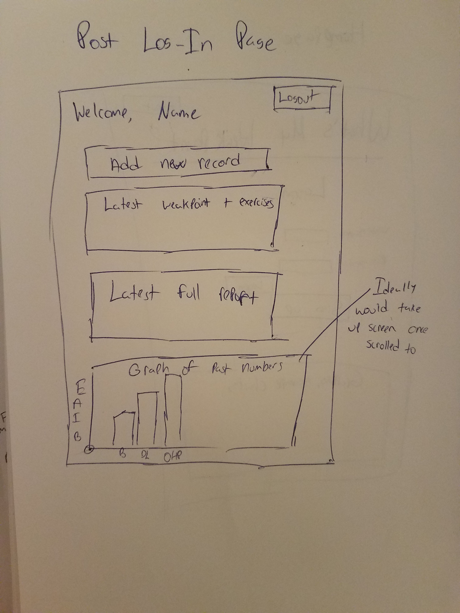
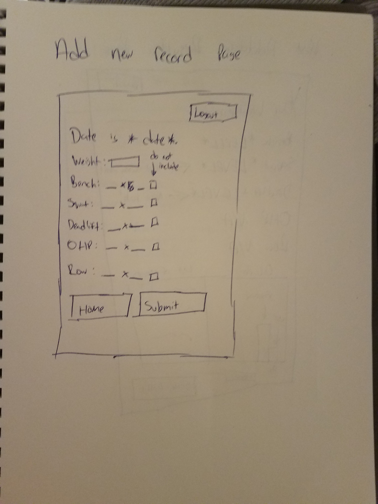
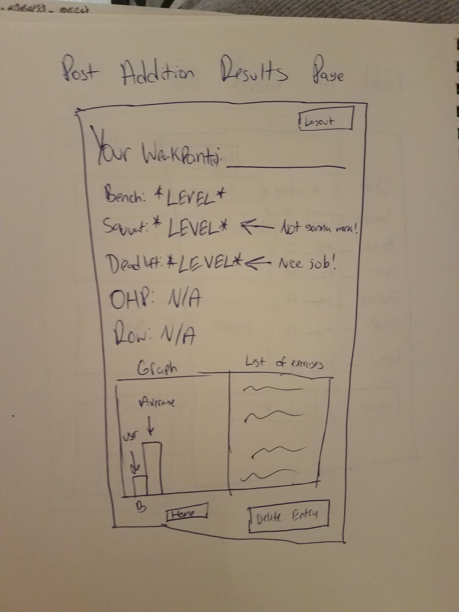
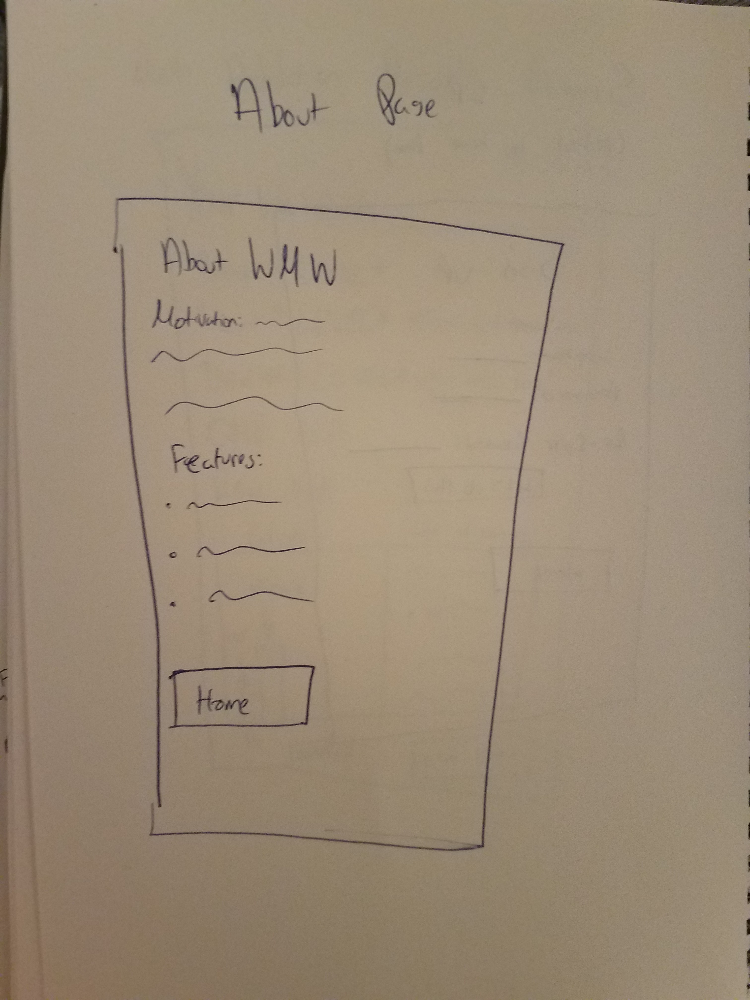
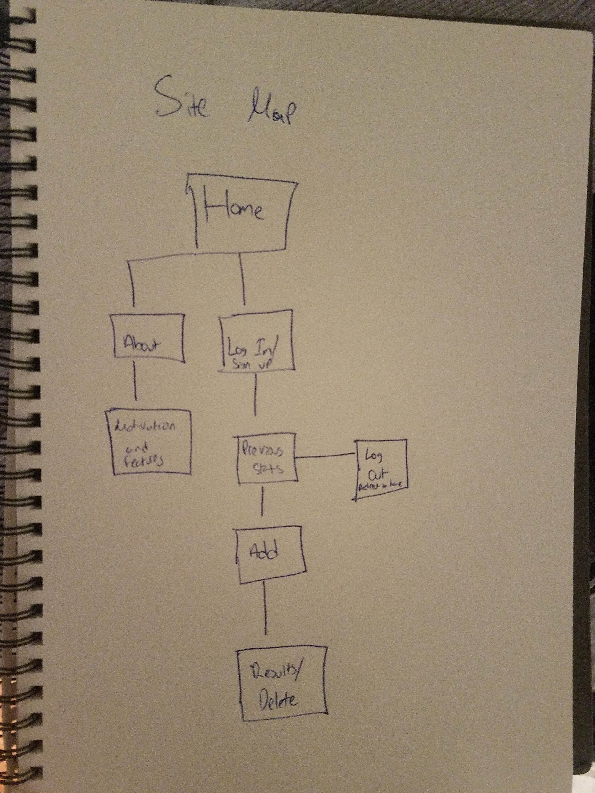

EDITS TO THE PREVIOUS ENTRIES IN THIS PROJECT:

1. Regarding Research Topics

I have decided to change research topics, and thus the new distribution will be as follows:
2 points - Bootstrap
6 points - Integrating Chart.js to display graphs, not Plot.ly

These will comprise all 8 points.

2. Regarding login

I ran it by Versoza, and he told me that it was okay to remove login in lieu of cookie-based memory.
The website will now use cookies that are remembered while the server has not been restarted/the user has not removed their cookies.
I have also given a form so that the user is able to search up old entries in case one of these events were to occur.

Beyond that, the project is largely the same as its inception, albeit with different graphs in different areas, and different layouts in each page.
Thank you, and have a wonderful day!
# Where's the Weakpoint?

## Overview

In weightlifting and bodybuilding, one's performance on compound lifts (specifically, the squat, bench, deadlift, overhead press, and row) is commonly used as both a goal and a metric for how strong someone is relative to their bodyweight. While there exists many websites that can tell one how they fare in a single lift relative to others, what might not be so clear is how to fix the weak links in their overall composition.

Enter "Where's the Weakpoint?". This website will take one's 1-5 rep max on up to the 5 aforementioned lifts and compare all of them to common strength level standards. It will then:
1. Tell the user how each lift fares
2. Bring up which lifts are proportionately weakest out of all of them 
3. Suggest specific isolation exercises that can be sprinkled in during their week to help bridge the gap between their weakest link(s) and the rest of their lifts. 

It will also keep track of previous reports so that the user can read up on their progress over time. 
## Data Model


The application will generally store:
- The users username 
- Their password hash
- A collection of their past entries and the reports they were given based on said entries

In a single session, the application will store the following based on user input:
- The users weight 
- How much weight they lifted on a lift, for up to 5 lifts (including how many repetitions)
- The rating each lift got based on the ratio the lift has to the users bodyweight 


An Example User:

```javascript
{
  username: "BuffChad22",
  hash: // a password hash,
  totalReports: // an array of past reports, consisting of 1. the users old input and 2. the report given based on said input 
}
```

An Example Entry with User Input:

```javascript
{
  user: // a reference to a User object
  inputs: [{
    date: 10/28/19,
    weight: 150,
    //sample lifts
    bench_weight: 200,
    bench_reps: 1,
    squat_weight: 245,
    squat_reps: 3,
    deadlift_weight: 0,
    deadlift_reps: 0
  }
  ],
  // reports calculated based on arithmetic and comparisons to current strength standards. 
  reports: [{
    date: 10/28/19,
    bench_rating: BEGINNER,
    squat_rating: INTERMEDIATE,
    deadlift_rating: N/A,
    ohp_rating: INTERMEDIATE,
    row_rating: N/A,
    weakpoint: CHEST 
  }]
}
```


## [Link to Commented First Draft Schema](db.js) 


## Wireframes


/ - homepage if the user did not log in



/signup - signup page. redirects to the new homepage when completed.



/[USERNAME] - shows users past records, redirect from login screen



/[USERNAME]/add - page to add a new entry



/[USERNAME]/results - gives results regarding the latest entry.



/about - information about the site, accessed from the front page



## Site map



## User Stories or Use Cases

(___TODO__: write out how your application will be used through [user stories](http://en.wikipedia.org/wiki/User_story#Format) and / or [use cases](https://www.mongodb.com/download-center?jmp=docs&_ga=1.47552679.1838903181.1489282706#previous)_)

1. As a non-registered user, I can register to the site so that I can use the service.
2. As either a registered or non-registered user, I can learn about the motivations and features of the site.
3. As a registered user, I can add my lifting numbers to the website so that I can be given a report.
4. As a registered user, I can read the report and choose to keep it or delete it.
5. As a registered user, I can go through my older reports so that I can analyze my results over time. 

## Research Topics


* (5 points) Integrate user authentication
- Users will need to log in to use the service
* (4 points) Integrate Bootstrap
- for expanding front end design beyond just javascript and html/css
* (3 points) Integrate plot.ly for graphing
- to integrate the graph of the users results 


## [Link to Initial Main Project File](app.js) 


## Annotations / References Used


1. [bootstrap tutorial](https://www.w3schools.com/bootstrap4/) - will provide user interactivity and correct scrolling for [app.js](app.js)
2. [strength level calculator](https://strengthlevel.com/) - will provide the basis for algorithm in [app.js](app.js)

